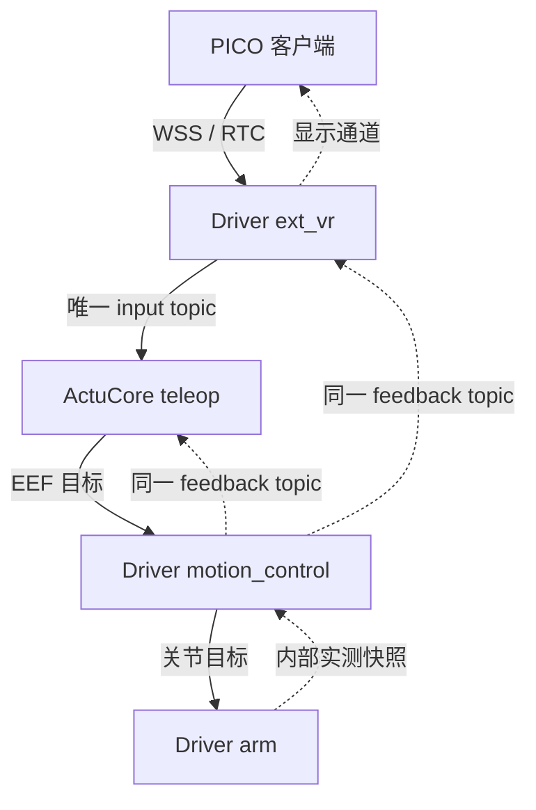

# ext_vr 设备接入设计与验收契约

关联 PR：[ext_vr #329](https://github.com/4paradigm/phanthymotus-driver/pull/329) · [teleop #259](https://github.com/4paradigm/phanthymotus/pull/259) · [天轶执行 #321](https://github.com/4paradigm/phanthymotus-driver/pull/321) · [G1 执行 #330](https://github.com/4paradigm/phanthymotus-driver/pull/330)。

将 PICO 客户端、安装配对和采集传输从 ActuCore teleop 拆为 Driver 的 `ext_vr` 设备卡，复用现有 ext 设备的 bundle、齿轮配置页和数据监控方式。目标是让实体 PICO 的安装、配对、输入采集与显示可独立验收，不等待机器人运动链通过。

**Draft · 本提交仅文档。** 日期：2026-09-23。本提交确定职责、接口、使用步骤与验收标准，不实现运行时代码，不代表已经完成构建、部署、设备测试或 BOT review。主仓配套改动关联 [phanthymotus #259](https://github.com/4paradigm/phanthymotus/pull/259)。

## 确定的架构

- `ext_vr` 的共享实现由天轶、G1 的原 Driver bundle 加载，沿用原 MCP 服务、注册身份和心跳：G1 MCP 15701，天轶 MCP 15707。不新增独立 ext_vr MCP 服务或 15742 端口；15741 只用于插件内部 PICO HTTPS/WSS 接入，保留 `/ws/teleop-capture`。
- 按现有 ext sensor 模式提供 `info/config/start/stop`、`configSchema`、实例状态和 topic 推导。设备实例与运动会话分开；一个 teleop 只绑定一个 ext_vr 实例，同一头显不能同时被两个实例接管。
- ext_vr 负责 App、APK、下载资料、邀请、配对鉴权、连接、OpenXR/WSS/RTC、设备输入和显示传输；不加载机器人 URDF，不计算 FK/IK，不持有运动租约，不发布机器人运动目标。
- teleop 负责双臂相对映射、使能、重握基准和运动会话；motion_control/arm 负责机器人模型、求解、执行权、实测反馈与停止。配对、连接和采集在线均不授予动作权限。
- 首版固定标准 `left/right` 控制器输入及 `head_reference`，各自携带有效状态。ext_vr 将设备坐标和单位规范化为右手跟踪空间（+X 前、+Y 左、+Z 上，位置为米，单位四元数顺序为 xyzw）；它不是机器人基座坐标。head reference 用于映射基准，不自动驱动机器人头部。首版不扩展任意肢体映射框架。

### 输入、反馈与管理接口

| 方向/入口 | 确定的内容与约束 |
|---|---|
| ext_vr → teleop、监控页 | 唯一输出 topic 为 `/{namespace}/ext_vr/{instance_id}/input`，实例 ID 的 `-` 按现有规则转为 `_`；格式 `data/json`，schema `motus.xr.input/1`。`info(instance_id)` 在采集未启动时也返回准确 topic。 |
| input 帧 | 包含实例/设备身份、采集连接代次、源序号、跟踪空间及空间代次、left/right 位姿与按键、head reference、逐对象有效性、头显采样时间和接收主机单调时间。不得携带机器人关节解或凭据。 |
| 时间与最新值 | 头显时钟不等于主机时钟；主机时间带启动/时钟身份，仅在同一时钟域比较。传输与发布只保留最新待处理帧，不积压重放；心跳、重连或转发不得刷新旧位姿的接收时间。跟踪失效或断流后不得把旧位姿当作有效新输入。 |
| 查询/配置 | 配对、连接、采集、新鲜度及确认配置由 `info(instance_id)` 返回；不新增独立 status topic。配置通过原 bundle MCP 下发，设备确认并读回后才持久化。 |
| motion_control → teleop、ext_vr | 两者直接订阅绑定的 `/{namespace}/motion/teleop/feedback`，格式 `data/json`，schema `motus.motion.feedback/1`。teleop 用于基准/执行状态，ext_vr 用于显示；不增加 teleop→ext_vr relay topic。ext_vr 校验绑定、会话和时效，不自行求解；旧反馈显示为历史或无效，不显示为当前执行成功。 |
| PICO 运动按钮 → ext_vr → teleop | 通过绑定的 MCP 管理入口可靠转发开始、正常结束、立即停止请求；请求携带唯一 ID、实例/采集代次和绑定身份，支持去重、查询及最终完成/失败回执。受理不等于运动完成，不混入最新位姿 topic，不接受头显指定任意管理 URL。 |

立即停止请求不能排在不可结束的显示或长操作之后。没有 teleop 绑定时仍可采集、监控和配对，运动按钮明确不可用。motion feedback 不替代 teleop 的项目状态与操作回执；这些由既定可靠管理通道返回，不为此新增显示中转 topic。显示断开或慢速消费不得阻塞采集、管理回执或停止。

### 代码归属与四个 PR 的配合

| 责任 | 仓库与提交范围 |
|---|---|
| ext_vr 功能 owner | 本 Driver PR：共享设备实现、App/制品、邀请配对、输入、显示、天轶/G1 bundle 的薄接入以及相应测试、许可证和文档。安装、配对和设备状态业务不留给 teleop。 |
| Core 宿主 writer | 主仓 [#259](https://github.com/4paradigm/phanthymotus/pull/259) 单列 ext_vr 伴随提交：复用齿轮页托管设备交互、固定下载代理、认证调用、配置确认及必要绑定。由 ext_vr owner 提供契约并负责设备验收，[#259](https://github.com/4paradigm/phanthymotus/pull/259) owner 独占主仓共享文件写入；不建设通用 UI/安装框架。 |
| teleop、天轶执行、G1 执行 | [#259](https://github.com/4paradigm/phanthymotus/pull/259) 的 teleop 提交处理输入消费和运动会话；两份机器人执行 PR 各自处理 motion_control/arm。四个 PR 同时推进，机器人执行实现不混入本设备 PR。 |

Driver PR 不包含 Core 仓库文件，也不为这次 UI 接线增开第五个 PR。Core 的伴随候选是设备齿轮页验收的版本依赖，但无须先完成 [#259](https://github.com/4paradigm/phanthymotus/pull/259) 的整链运动验收。涉及 bundle 的公共加载文件时，先固定本 PR 的设备接入提交，再由对应执行负责人基于该明确版本追加运动接入，不并发改写同一段。

## 使用与范围

天轶与北京 G1 同时推进，核实设备占用与操作条件后，哪个空闲先测试哪个；逐台记录结果，不能以一台通过替代另一台。北京实体 PICO 用于本设备链验收。PICO 设备验收不要求运动链已接通；本 PR 的配对和采集操作不隐含机器人动作授权。

1. 在现有 Driver bundle 的工具列表添加 `ext_vr` 实例，点击卡片齿轮。卡体只保留状态、齿轮、端口、查看数据流及现有卡片管理入口，不出现安装、邀请、配对或动作表单。
2. 在同一齿轮页完成设备选择/配置、APK 下载链接与二维码、安装邀请、配对批准/拒绝、撤销和连接状态查看。项目尚未启动时也能安装、配对；配置修改沿用现有停止项目后编辑的规则。
3. 在实体 PICO 浏览器打开链接，下载并完成系统安装，再使用一次性邀请打开应用、核对身份并连接。下载票据与配对邀请分开；ADB 安装、桌面浏览器或模拟客户端不能代替本步骤的验收。
4. `start(instance_id)` 仅开始发布采集输入；进入“查看数据流”核对 left/right、head reference、按键及有效性。未接 teleop、未加载运动模型时也应可完成这一闭环；`stop(instance_id)` 只停止该采集实例，不执行机器人运动或收臂。
5. 连接 teleop 和运动消费者后，PICO 才显示可用的运动操作。按钮经可靠管理通道转发，最终是否执行由运动链判断；直接 motion feedback 只提供实际状态/显示，不构成另一条控制路径。
6. 配置被拒绝、超时或读回不一致时，齿轮页保留上次确认值并显示失败，不写入假成功配置；运行状态与持久化状态不一致时分别报告。关闭齿轮页只取消轮询、清除页面内邀请资料和忽略迟到回复，不隐式撤销配对或停止已运行采集。

### 迁移与失效处理

PICO App 保持现有 applicationId 和签名边界，迁移客户端来源及许可证。旧 ActuCore capture 与新 Driver ext_vr 不能同时监听同机 15741；确认旧监听已退出后才启用新接入。客户端一次只连接一个目标：切换前关闭旧 WSS/RTC、取消旧重连、清空待发帧并更新连接代次，迟到回调不得进入新会话。回滚也先退出当前接入服务，不同时启动两套采集。

配对状态及证书由单个服务独占管理，能够兼容时保留原身份；不兼容时明确重新配对，不静默信任陌生身份或卸载 App。邀请过期、重复兑换、证书不匹配、旧连接/空间代次、乱序帧、失焦、休眠和跟踪丢失均须有可观察的结果。邀请、令牌、管理密钥及完整私有端点不进入 topic、可分享 Canvas 配置、活动日志或验收正文；需要的诊断证据脱敏保存。

## 本 PR 交付与验证状态

### 本次交付

- [x] 确定本设计/验收契约，并在 README 标记为“计划/未实现”入口。
- [ ] 实现共享 ext_vr、两个 bundle 接入、App/制品与设备生命周期。
- [ ] 完成 [#259](https://github.com/4paradigm/phanthymotus/pull/259) 的 Core 伴随接线并记录兼容提交。
- [ ] 完成目标架构构建、离线/隔离验证、开发实体 PICO 测试、BOT review 和最终实体 PICO 验收。

本次仅新增文档和计划入口，没有运行功能测试、构建镜像、安装 APK、连接设备、部署或申请 BOT review。下表均为待执行验收，不将旧 teleop 实现或历史真机记录记为本 PR 通过。

### 验收顺序与用例

严格按 **离线 → 开发实体 PICO → 确切 HEAD 的 BOT review 通过 → 最终实体 PICO 验收** 推进。离线包含实际目标架构构建及隔离接口链路；开发测试完成后才能请求 BOT review。审查导致代码变化时，先重跑受影响离线与实体测试，再审查新 HEAD；最终验收使用审查通过的同一候选及固定兼容版本组合。首次开发测试不替代最终验收。

| 编号 | 前置条件 | 步骤 | 预期结果 | 当前结果 |
|---|---|---|---|---|
| EXT-01 | 两个 bundle 的离线候选与隔离环境就绪 | 分别启动只启用设备链的配置，查询工具和实例 info，再禁用插件 | 复用原 MCP/注册身份；topic 可预先解析；没有独立 MCP、运动租约或运动发布；禁用不影响其他卡 | 未执行 |
| EXT-02 | [#259](https://github.com/4paradigm/phanthymotus/pull/259) Core 伴随候选可用，项目未启动 | 添加实例、打开齿轮页，再检查卡体和查看数据流入口 | 安装/配对/配置只在齿轮页；未启动项目可操作；卡体无设备动作表单 | 未执行 |
| EXT-03 | 配置接口可控制成功、拒绝、超时和读回不一致 | 逐项保存配置并重新打开齿轮页；过程中关闭弹窗/切换实例 | 只有确认且读回一致的值持久化；失败不报成功；迟到结果不污染其他实例 | 未执行 |
| EXT-04 | 固定输入 fixture、单调时钟及队列观测可用 | 注入正常、旧序号/代次、失效跟踪、时钟不匹配和积压输入 | 仅一个 input topic；字段/单位正确；旧值被拒绝或标无效；只保留最新帧，头显时间不冒充主机时间 | 未执行 |
| EXT-05 | 可注入 motion feedback，尚无机器人动作 | 让 teleop 与 ext_vr 订阅同一反馈，注入新鲜/过期/错误会话数据并使显示消费变慢 | 无 relay/status topic；显示区分有效与历史；采集和管理不阻塞；ext_vr 不求解或申请执行权 | 未执行 |
| EXT-06 | 已绑定的管理替身和未绑定场景均可用 | 请求开始/结束/立即停止，重复 ID、断开回复及恢复查询；再撤销绑定 | 去重且可取得最终回执；受理不冒充完成；停止不被长操作堵住；未绑定拒绝运动请求，采集仍可用 | 未执行 |
| EXT-07 | 签名 APK、清单、离线构建环境及两个 bundle 构建配置就绪 | 完成目标架构构建，核对 APK 哈希/签名/版本，检查 normal build 与包内许可 | 制品可核验，无专用构建开关或额外服务；已用普通卡片构建/生命周期回归通过 | 未执行 |
| EXT-08 | 实体 PICO、Core/Driver 候选及安装链接可用 | 用户或雨强在 PICO 浏览器下载并完成系统安装，通过齿轮页邀请配对 | 原始 APK 安装成功；包身份正确；邀请预填正确接入与证书；连接不启动机器人；记录真实安装过程 | 未执行 |
| EXT-09 | 实体 PICO 已配对，运动链未启用 | 冷启动连接、采集双手/头部与按键，在 Canvas 查看输入；停止后再启动 | 无模型/IK/租约也可监控；字段与实际动作一致，停止不继续发布有效旧输入；无需启动机器人动作 | 未执行 |
| EXT-10 | 实体 PICO 连通且可观察日志/界面 | 失焦、休眠、遮挡跟踪、空间重置、断网重连；再测试过期/重复邀请和撤销身份 | 失效明确可见，恢复只处理新输入；陌生/撤销身份不能自动信任；敏感值不进入日志/配置/topic | 未执行 |
| EXT-11 | 旧、新服务候选及回滚资料固定；现场允许切换采集服务 | 关闭旧监听后接入新服务，再按反向顺序回滚；核对客户端重连与双实例争用 | 15741 单一所有者、客户端单一主动连接；旧回调/帧无效；同头显不被双实例接管 | 未执行 |
| EXT-12 | 天轶、北京 G1 分别具备空闲窗口；EXT-01 至 EXT-11 有对应证据 | 在两个 bundle 的兼容候选上分别复测设备接入；记录先测设备与未测项 | 逐台证明 ext_vr 接入和普通卡不回归；不要求机器人动作；未测设备保持未通过 | 未执行 |
| EXT-13 | 本 PR 离线及开发实体测试通过，HEAD 和依赖固定 | 对确切 HEAD 发起 BOT review，处理意见后补测并复审 | 审查与构建通过且关联准确 SHA；旧 HEAD 结论不沿用 | 未执行 |
| EXT-14 | EXT-13 通过，最终 Driver/Core/镜像/APK/配置组合固定 | 用户或雨强重新执行实体安装、配对、输入监控、断线恢复和关键失效流程 | 最终候选实体 PICO 验收通过才标记设备 PR 完成；不等待机器人运动，也不将本结果记为运动验收 | 未执行 |

### 共用验收记录模板

每轮、每台接入宿主及每个验收编号分别填写；预期结果不当作实测结果。结果只填“通过 / 失败 / 阻塞 / 未执行”，失败原因与未测项保留，不覆盖历史记录。

| 字段 | 记录内容 |
|---|---|
| 编号/阶段 | EXT-xx；离线、开发实体、BOT 或最终实体 |
| 对象与前置 | 天轶或北京 G1 的设备标识、PICO 标识及版本、空闲/操作条件、相关实例与绑定；公开记录只保留可共享标识 |
| Driver 源码 | 仓库、PR、完整 commit SHA、dirty 状态；最终验收必须对应审查通过的确定候选 |
| Core/teleop 依赖 | [#259](https://github.com/4paradigm/phanthymotus/pull/259) 的完整 commit SHA、Core 伴随提交、使用到的 teleop 版本；未使用时明确填不涉及 |
| 镜像 | Driver/Core 镜像名称、不可变 digest、目标架构；不能只填可变 tag |
| APK | applicationId、versionName/versionCode、文件 SHA256、签名证书 SHA256、实际浏览器下载/安装方式 |
| 配置/契约 | 脱敏配置或配置哈希、schema 版本、实例/绑定身份、topic/type/QoS、时钟域和可复现实验参数 |
| 实际步骤 | 操作顺序、执行命令或页面路径、故障注入与恢复步骤；区分受控替身与实体设备 |
| 实际证据 | 脱敏日志、截图/视频、采集/反馈记录和构建/审查结果的可访问位置；不粘贴邀请、密钥或私有录制内容 |
| 结果 | 通过 / 失败 / 阻塞 / 未执行；填写实际观察、预期差异、失败原因、未测项及后续复测编号 |
| 验收人/日期 | 实际执行人、确认人（用户/雨强）、日期时间及时区；未确认时不得代签 |

本次文档检查记录由提交前检查填写；运行实现、设备验收和 BOT 结果必须在实际执行后补充。部署、源码完成、BOT 通过和最终实体验收分别记录，不能互相替代。
