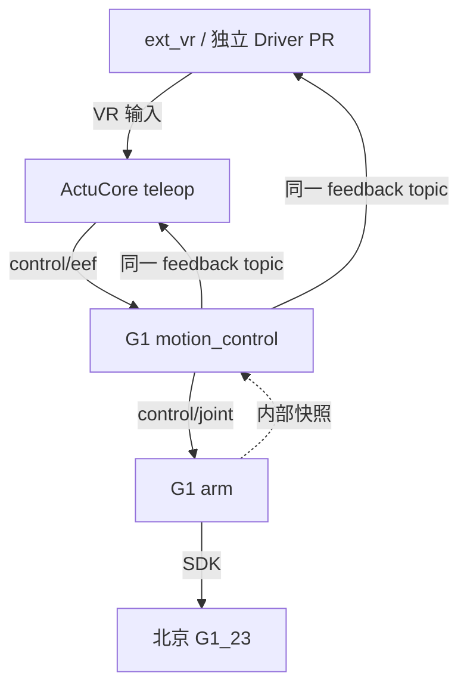

# G1 双臂 motion_control / arm 契约与验收计划

关联 PR：[ext_vr #329](https://github.com/4paradigm/phanthymotus-driver/pull/329) · [teleop #259](https://github.com/4paradigm/phanthymotus/pull/259) · [天轶执行 #321](https://github.com/4paradigm/phanthymotus-driver/pull/321) · [G1 执行 #330](https://github.com/4paradigm/phanthymotus-driver/pull/330)。

本 PR 将北京 G1 的双臂遥操接入 `ext_vr → ActuCore teleop → Driver motion_control → arm`，使输入频率与执行频率解耦，并复用现有 `arm.release` 完成 SDK 控制权交还。

**状态：Draft，运行时尚未实现。当前变更仅包含计划与 README；未修改运行时代码，未构建、部署、执行真机动作或取得 BOT review。本文新增流接口均为待实现契约，release 为现有能力的复用与补强，验收项均未执行。**

## 确定的架构

四个 PR 独立实施：[ext_vr Driver #329](https://github.com/4paradigm/phanthymotus-driver/pull/329)、[主仓 teleop #259](https://github.com/4paradigm/phanthymotus/pull/259)、本 G1 Driver PR，以及[天轶 Driver #321](https://github.com/4paradigm/phanthymotus-driver/pull/321)。**天轶 #321 并行推进，不暂停。** 本 PR 不搬运天轶或旧 G1 worktree 的未提交内容；共享契约需跨 PR 对齐，G1 执行实现不放入 #321。

### 固定 I/O 与 descriptor

目标是**北京 G1_23，每臂 5 关节，共 10 关节**，profile 为 `unitree_g1_23_dual_arm_relative_v1`。本链路不控制腰、腿、手或夹爪，不采用 7 关节手臂默认值。 每臂 5 自由度不承诺任意 6D 末端姿态精确可达；沿用冻结基线的任务权重和可达性处理，报告残差，不新增严格姿态门槛造成跟随回归。

| 边界 | Topic | 格式与消息 | 固定含义 |
|---|---|---|---|
| teleop → motion_control | `/{namespace}/motion/control/command` | `control/eef`，`schema=motus.control/2`，`mode=eef_pose` | `values` 为左、右两组 `[x,y,z,qx,qy,qz,qw]`，共 14 个数；位置 m，单位四元数；坐标系与 TCP 由已校验模型/标定声明。 |
| motion_control → arm | `/{namespace}/motion/arm/command` | `control/joint`，`schema=motus.control/2`，`mode=joint_position` | 纯位置 10 维，单位 rad；先左臂后右臂，每侧依次为 shoulder_pitch、shoulder_roll、shoulder_yaw、elbow、wrist_roll。无公开 `tau_ff` 扩展。 |
| motion_control → teleop、ext_vr | `/{namespace}/motion/teleop/feedback` | `data/json`，`schema=motus.motion.feedback/1` | 唯一公开运动反馈 topic；teleop 与 ext_vr 直接订阅同一 topic，消费相同序号与状态，不通过 teleop 转发。 |
| arm → motion_control | 无外部 topic | Driver 内部不可变快照 / 有界 IPC | 提供实测状态、实际成功发布及执行权状态；不是 Canvas 端口，不新增 arm 外部反馈边或 relay。 |

`info()` 按上述模板返回实际 namespace 下的 topic，返回路径为权威；Canvas 按端口连线，不猜 hostname 或另起别名。反馈至少区分目标接收、实际发布、实测关节与末端、IK 结果、采样新鲜度、会话/输入/执行序号、保持/故障原因、执行权、SDK 交还与 release 操作状态，并提供可变长度显示链；接收 ACK、发布 ACK、实测完成不能合并成一个“成功”。

- EEF descriptor 的 `dof=14`，`groups` 为左 `[offset=0,count=7]`、右 `[offset=7,count=7]`；它描述 14 个位姿数，不是 14 个物理关节，也不能解释成 14 项关节限位。
- joint descriptor 的 `dof=10`，`groups` 为左 `[offset=0,count=5]`、右 `[offset=5,count=5]`；名称、上下界与速度数组均为 10 项，与反馈同源生成。开发与 A/B 对照默认 **1 rad/s**，执行仍遵守已核验模型的实际关节限制；这不是新增通用硬上限。
- 两端显式声明 `force_torque: null`。内部重力补偿不代表具备力传感器或力控制接口。模型、关节映射、坐标系、TCP、标定身份必须一致后才允许执行。
- 消息与 descriptor 的 schema、mode、dof、长度、顺序、有限值、四元数、会话、序号和源有效期均须验证；不截断多余维度、不补齐缺失维度。保持现有 `motus.control/1` 与天轶解析行为兼容。

同机数据面使用 ROS domain **42**、loopback，并采用 `BEST_EFFORT`、`KEEP_LAST depth=1`、`VOLATILE` 的最新值语义。数值、命令与反馈内部队列均须有界；状态发布与慢消费者不能阻塞 arm 执行/停止线程。topic/schema 与主仓四卡契约一致，不为 G1 新建另一套总线协议。

### 计算、运动包络与连续执行

`motion_control` 的独立数值进程承担模型加载、IK 与运动包络生成/验证。它输出完整关节目标，**不按每个输入帧固定 20 ms 做执行限速**；原 G1 的输入间隔限速也迁出此层。约 20 Hz 输入时，arm 仍应独立连续推进，不能把输入帧数当可运动时间。

运动包络以新鲜实测位置和上次实际发布位置为起点，覆盖关节不同步运动形成的中间状态，沿用冻结基线的碰撞/间隙检查。仅检查目标端点或名义同步直线不够。一次完整目标无法覆盖时，数值进程生成可验证的中间包络并持续重算；这是路径安全约束，不是输入帧速率限幅。

包络凭据经 Driver 内部快照/IPC 传递，绑定模型/标定 hash、关节映射、控制者、会话与目标代次、源截止时间和有效起点/范围，不增加公共 joint payload 字段。arm 每拍只进行有界的身份、时效、有限值、限位与包络包含检查；FK/碰撞搜索不得占用发布或停止锁。包络失效或实测状态越界时保持并请求重算，不能等待重计算阻塞停止，也不能绕过检查继续运动。

arm 拥有独立连续执行时钟，目标采用最新有效值，初次接管从新鲜实测位置起步。每拍从上次实际成功发布位置向目标限速插补，`dt` 依据实际成功发布时刻计算；长间隔的执行 `dt` 上限保留为 20 ms，暂停/丢帧期间不积累“追账”额度。这个执行端上限与已移除的 IK 每输入帧限速不同。

在最终限速后的 `q_cmd` 上，arm 使用预加载、独立 Data 的 G1_23 Pinocchio 模型计算 `RNEA(q_cmd, 0, 0)`，得到内部 10 维 Nm 重力补偿。检查有限值、维度及既有补偿/URDF 力矩限额，不将 IK 输出的旧力矩用于新 q；执行线程不运行 CasADi/IPOPT 或重 IK。模型或补偿失败进入明确保持/故障状态，禁止默认为零力矩继续运动。停止和 SDK 交还路径不依赖 RNEA 成功。

发布前最后复查取消、源截止时间和目标代次，只有 SDK 实际成功写入才推进发布序号/时钟。数值进程卡住、ROS 发布阻塞或遥操状态故障不能阻止 arm 的停止和直接 release 入口。

## 使用与范围

### 丢帧、跳变及故障恢复

- 指令有效期继承源输入截止时间，排队、IK 完成、重算包络和转发不得续期。最新输入覆盖旧目标，不排队回放过期运动。
- 同一有效会话的短时丢帧或目标跳变由连续限速与包络校验衔接；保持后从当前实测状态续接，保留原相对映射、标定和用户目标，不自动重设锚点或吞掉位移。源会话改变、跟踪失效或映射不连续须明确暂停，经过显式重获流程后才恢复。
- 限速或暂时不可达可以带来延迟，必须有可观察原因与恢复路径，不能静默永久卡死。硬件错误、反馈失效、写入失败和控制权冲突分别报告；硬件故障不得自动清错或伪报成功。
- bus 局部故障与状态发布拥堵由对应通信组件有界恢复，保留执行权、会话代次和故障记录；重建订阅/发布前清除过期队列，恢复后重新检查源截止时间与实测状态。不得靠重启整个 Driver 清租约，不放宽 deadline，也不借恢复重放过期命令；恢复尚未满足条件时保持并上报原因。
- 新链路与已有 `arm` 手势、`servo`、`servo_eef` 共享执行权仲裁，防止多个 SDK 写入者。保留现有功能与 v1 接口；占用未知或属于其他来源时拒绝抢占，不靠关闭所有旧功能获得排他性。

### 复用 release / action 99

复用现有 `arm.release → ExecuteAction(99)`，以及已有 `execute(action_id=99)`、`execute(gesture="release arm")` 别名；三者归一到同一受控交接路径。不得把字符串 `release` 加入全局免检查名单，否则可能意外放行其他工具的控制权操作。

本 Driver 自有遗留会话的恢复顺序为：撤销输入和晚到 IK 结果 → 保持并停止继续追踪 → SDK 权重交还及实际成功写入确认 → 新鲜实测状态确认 → 调用既有 action 99。交接失败保留占用与明确状态，不能因超时擅自释放账面控制权。面对其他控制源或未知占用，只报告冲突并等待明确交接。

沿用 arm 的 MCP/Canvas release 入口，使其独立于 PICO、teleop、IK 工作进程。对同一 `operation_id` 合并重复/进行中请求；同 ID 不重复触发动作。SDK 返回码与交还、物理状态分开记录：`ExecuteAction` 只返回 RPC code，`ret=0` 不是动作完成证据。超时标为结果未知，先读取新鲜状态，再由显式重试发起新操作，不能自动盲重发。

本 PR 不新增 `return_to_zero`，不自建回零轨迹，不假定 q=0 是自然下垂，不执行编码器归零或标定。最终物理姿态以机型与现场状态确认，不从 action 名称推导。

### 冻结行为基线及证据缺口

行为对照固定为 **2026-09-19 周六晚 G1 开发版**，不能用最近提交替代。以下是已有本地记录，来源为上海，不证明北京部署或北京验收通过。

| 对象 | 已有身份记录 | 待补证据 |
|---|---|---|
| ActuCore | `local/phanthy-motus/actucore:g1-visible-follow-20260919` | 完整镜像 ID / digest、最终镜像所含源码 manifest。 |
| Driver | `local/phanthy-motus/g1:visible-follow-ad47f01-r3-20260919` | 完整镜像 ID / digest、r3 的最终源码 manifest；`ad47f01` 只是基点，不能代表 dirty overlay。 |
| PICO | V036，versionCode `10`，`0.3.6-ikview1`；APK SHA-256 `5f1869eaf6c36b163fc441131344261f82e1faf62e0e6e58a412940dc822ac95` | 将 APK 校验记录与冻结运行/安装记录关联，验收前再核对实际使用字节。 |
| 模型 / 标定 | G1_23 双臂 10 关节；旧冻结模型与当前主线模型并非相同字节 | 实际标定 hash、模型/网格/TCP/限位 manifest，以及北京硬件身份与几何核验。 |

旧记录含跟随中断，不能作为整套行为已通过的证明。缺失的镜像/源码/标定身份必须在真机 A/B 前补齐并冻结；离线开发可继续，但不能提前标记基线复现完成。不新增误差百分比、累计行程或固定 50 Hz 的通过门槛。

复用实现的核对入口为 [arm/action 99](../../unitree/g1/device.py)、[SDK RPC 返回值](../../unitree/g1/unitree_sdk2py/g1/arm/g1_arm_action_client.py)、[SDK 通道](../../unitree/g1/arm_sdk.py)、[现有 EEF 机型适配](../../unitree/g1/servo_eef.py)、[现有控制 descriptor](../../common/control/descriptor.py) 与 [G1 Driver 说明](../../unitree/g1/README.md)。旧 G1 solver、运动包络与执行反馈只按清单迁移，核对来源、模型/网格 hash 和许可证；不复制整棵旧 dirty 工作区。

## 本 PR 交付与验证状态

### 阶段门禁

- [ ] **离线测试**：实现契约与失败路径，完成真实数值模型和目标 ARM64 环境的必要验证；mock 与离线结果明确标注。
- [ ] **开发真机测试**：离线通过后，在北京 G1_23 按授权窗口测试、定位并修复问题；这是开发证据，不是最终验收。
- [ ] **确切 HEAD 的 BOT review 通过**：开发真机测试通过后，对拟验收的完整 commit SHA 审查；保留 review 链接、结论与对应镜像。
- [ ] **最终真机验收通过**：部署与审查 HEAD 对应的镜像，完成下面的基线 A/B、停止和恢复验收。相关修复后更新 SHA，重跑受影响测试、开发真机验证与 BOT review，再做最终验收。

任何阶段的 HTTP 成功、进程存活、SDK ACK、合成输入或 BOT review 都不代替物理反馈。真机阶段须先确认设备身份、现场安全、执行权和现场人员授权；本计划不自动执行模式切换、接管或动作。

### 验收用例

各行均须记录阶段和独立证据；离线通过不能勾选同一项的最终真机结果。下表当前全部未执行。

| 编号 | 阶段与前置 | 步骤 | 预期 |
|---|---|---|---|
| G1-01 | 离线；固定两端 descriptor | 校验 EEF 14 数、joint 10 数及左右分组；注入 14 关节、16/19 维旧契约、乱序、缺项、非有限值和无效四元数。 | 正确契约通过；不匹配明确拒绝，SDK 零写入；v1 和天轶回归不变。 |
| G1-02 | 离线；模型与标定 manifest | 校验 G1_23 关节映射、模型/网格/TCP/限位 hash；注入 29dof 或标定不匹配。 | 身份不符不启动；10 个实际关节与反馈顺序一致，无腿/腰/手写入。 |
| G1-03 | 离线；可控时钟、有效包络，配置对照速度 1 rad/s | 同一大目标分别以 20 Hz、50 Hz 更新；在输入帧之间观察连续发布，再注入长调度间隔。 | 两种输入均独立连续推进，满足配置速度与实际模型限制；不按输入帧数缩小行程；长间隔无追账突跳。 |
| G1-04 | 离线；固定映射与源时间 | 丢帧、有效目标跳变、暂停后续接；插入过期/乱序/旧会话/晚到 IK 结果。 | 原映射与目标保持；有效目标平滑续接；失效结果不续期、不重放、不恢复执行。 |
| G1-05 | 离线；真实几何与数值进程 | 测试端点安全而途中碰撞、关节不同步、实测偏离包络、旧包络复用；阻塞/终止数值进程同时取消。 | 不发布未经覆盖的运动；保持原因可见、可重算恢复；停止不等待 IK/碰撞计算。 |
| G1-06 | 离线及 ARM64；最终 q 可记录 | 比较限速前后 q 对应 RNEA；注入非有限值、力矩超限及计算异常；测执行负载与并发取消。 | 补偿使用最终 q，10 维且限额有效；失败不静默继续；停止/交还不依赖补偿成功。 |
| G1-07 | 离线集成；同机 domain 42 / loopback，BEST_EFFORT depth 1；SDK 与通信可注入失败 | 制造发布失败、反馈变旧、子进程死亡、SDK 调用阻塞与晚 ACK；注入 bus 局部故障、状态拥堵与慢消费者，观察队列边界并恢复通信。 | 区分接收/发布/实测；停止不被状态通路阻塞，队列有界；通信局部恢复后续接，不重启 Driver 清租约、不放宽 deadline、不重放过期命令；不虚增成功序号或过早释放占用。 |
| G1-08 | 离线集成；三类 release 入口 | 通过 release、ID 99、gesture 别名调用；重复 operation_id；关闭 PICO/teleop/IK；注入交还失败、RPC 非零及超时。 | 同一交接路径，重复操作不重复触发；失败/未知不盲重试；直接 release 可用，无新回零轨迹。 |
| G1-09 | 离线集成；多控制源 | 与既有 arm 手势、servo、servo_eef 竞争；测试本方遗留与外部未知占用。 | 单一写入者；本方可取消、保持、交还；他方不被静默抢占；其他工具的 release 不被全局放行。 |
| G1-10 | 离线联调；ext_vr 与[主仓 teleop #259](https://github.com/4paradigm/phanthymotus/pull/259) 对接 | 两消费者同时订阅 `/{namespace}/motion/teleop/feedback`，校验 `motus.motion.feedback/1`；停止任一消费者，核对 Canvas info 返回端口。 | 两消费者直接收到相同原始状态；无 teleop relay 或 arm 外部反馈边；消费者退出不阻塞执行/停止。 |
| G1-11 | 开发真机；离线通过、北京身份/基线/授权齐备 | 读回镜像/标定；从实测起步，以 1 rad/s 单臂再双臂跟随，检查约 20 Hz 输入与反馈。 | 北京 G1_23 映射正确；可以延迟但持续推进，不永久卡死；记录真实输出和问题，不能记为最终通过。 |
| G1-12 | 开发真机；安全故障注入范围已授权 | 验证暂停/恢复、输入或 IK 退出、取消和 SDK 交还；依次核对三个 action 99 入口。 | 停止/交还及后续姿态有实测证据；硬件故障不自动清错；超时/未知有明确人工恢复路径。 |
| G1-13 | BOT；开发真机问题已修复复验 | 对确切 HEAD 获取 BOT review，记录完整 SHA、结果链接及镜像关联。 | 对应 HEAD 审查通过；旧 HEAD 的通过结论不能继承。 |
| G1-14 | 最终真机；G1-13 通过、A/B 身份冻结 | 在北京按相同输入、映射、标定和 1 rad/s 对照周六晚基线，复验跟随、丢帧/跳变续接、停止、故障恢复与 release。 | 已审查版本行为符合本契约；延迟可接受、不可卡死；保留原始实测与现场结论，不新增误差/频率门槛。 |

### 每项验收记录模板

| 字段 | 填写内容 |
|---|---|
| 用例 / 阶段 | `G1-__` / 离线、开发真机、BOT 或最终真机；当前：未执行 |
| 源码 SHA | Driver 完整 SHA；ActuCore、Core、ext_vr 完整 SHA；dirty 或构建 overlay 必须有逐文件 manifest |
| 镜像 | 各组件 tag + 完整 image ID / digest；证明对应上述源码 |
| 基线 | 冻结基线身份及 A/B 运行编号；缺项明确填写“缺失”，不以日期或最近 commit 代替 |
| 设备与配置 | 北京 G1_23 身份、模型/网格/TCP/标定/config hash、APK 版本和 SHA、速度与输入条件 |
| 证据 | 测试命令/日志、实际发布与实测时间线、反馈序号、视频或现场记录、BOT 链接；标明 mock/合成/真机 |
| 结果 | 未执行 / 通过 / 失败 / 阻塞；填写实际观察、错误、恢复路径及复验记录 |
| 验收人 / 日期 | 姓名；带时区的日期时间；真机验收须有现场确认 |

当前只有本文和 README 文档变更，以上验收记录均为空。部署、运行接口和硬件能力仍以当前已实现代码及现场核验为准。
