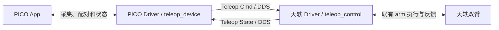

让用户从 Canvas 齿轮页进入 PICO App 安装、配对与连接流程，使用独立 PICO Driver 向天轶输出标准遥操输入。关联 [天轶 Teleop Control #321](https://github.com/4paradigm/phanthymotus-driver/pull/321)。本PR不包含机器人模型或执行逻辑。

## 确定的架构

本轮只交付 #329 与 #321，两张卡全部位于 Driver 层。Agent Core、ActuCore 零代码变更，也不依赖旧遥操专用代理、鉴权 Header、绑定管理、模板或反馈边。宿主能力不足须列出证据、影响及选项，交由韩泽北决策，不静默增加 Core 改动或脚本替代流程。#259 与 G1 #330 不属于本轮交付。

Canvas 只需连接 teleop_device → teleop_control；两 Driver 根据同一实例派生反向反馈绑定，无需用户画循环边。MCP 只负责注册、查询、配置和生命周期，连续输入、操作请求与回执通过 DDS。两卡可分别启动，未连接时返回明确待就绪状态，不无限阻塞项目启动。

普通Core齿轮页不支持可点击网址。本轮采用安装步骤与网址字段展示、用户复制到浏览器的入口；用户已于2026-09-23明确接受，Core继续零改动。实体PICO的浏览器下载/安装/证书信任仍单独验收。

### 输入、反馈与生命周期

| 方向 | topic / format / schema | 内容 |
|---|---|---|
| PICO → 天轶 | `/<namespace>/teleop/<instance>/command`；`data/teleop-cmd`；`motus.teleop.command/1` | 标准双手柄、头显参考、握把、跟踪有效性；独立操作请求 |
| 天轶 → PICO | 对应 `/feedback`；`data/teleop-state`；`motus.teleop.feedback/1` | 能力、会话、源序号、IK/执行原因、实测状态及操作最终回执 |

两端使用同机隔离 DDS domain 42、版本化 JSON。设备输入保留 instance/device、connection_epoch、space_epoch、sequence、采集与接收单调时间、clock_id；位置为米、四元数 xyzw，设备跟踪系 X前/Y左/Z上，不能当机器人基座系。旧采集协议可在设备内部复用，外部不能把旧schema冒充新schema。未知schema、非法数值、过期或旧代次输入明确拒绝。

姿态 latest-only；操作请求与可覆盖姿态缓存分开，携带 request_id，受限重试、去重并返回最终完成/失败结果。停止优先，不等待长收臂、IK或显示操作。旧连接的开始请求不重放；心跳和转发不刷新旧位姿有效期。反馈慢不能拖住输入或停止。敏感配对资料不进入topic和可分享配置。

Canvas启动仅使接口就绪，无自动动作；PICO开始建立操作会话。松握保持；再次双握只处理下一有效输入帧，沿用原映射，不重标定。PICO结束并收臂使用受控自然下垂动作，以实测确认完成。PICO立即停止及Canvas停止只中止当前操作并保持，不追加收臂。

## 冻结基线与明确差异

行为对照组合为 Tianyi ActuCore unified r4 `sha256:584e7d3402c52c93a976f39740057dd73b9b90a06d0d4f935f356e035104c091` 与 Driver operator r16 `sha256:f41c7bb5352a29d3a41dc3d5d6357000a2634ad27cfb580d4546a9b1476288c1`。补齐源码、APK、模型、标定和录制身份，固定同一输入、初态及速度再比较。旧测试不是本轮通过证据。

应保留坐标方向、可完成动作链和收臂表现。用户已批准的行为变化：重握不重标定、输入和执行频率解耦、Canvas停止仅保持。新增平滑独立开关与对照，不与架构迁移混在一起归因。首轮速度1rad/s；约20Hz输入是测试场景，不要求稳定50Hz，不新增百分比误差门槛。如实记录误差、延迟、最长中断和恢复时间；可以短暂停顿，条件恢复后必须继续。

## 本 PR 实现与使用

- 独立目录 pico/pico、Driver ID pico-driver、卡片teleop_device，MCP15742，PICO接入15741。设备端不再嵌入天轶/G1 bundle；不需要机器人设备权限或特权容器。
- 齿轮页列出机器人侧两个Driver和头显App的安装步骤、默认“否”的“是否已经安装遥操驱动”及下载/配对入口。确认值由用户手动改为“是”，不能替代实际在线状态或授予运动权限。卡体保持简洁，配置保存后Driver读回实际值。
- 原生App及签名身份稳定，APK随普通镜像交付，版本和SHA可核验；无需改BOT或新增构建开关。PICO浏览器短网址下载、系统安装、返回连接入口预填机器人参数后连接。已配对设备冷启动重连。同签名升级保留配对。二维码须实机验证，ADB仅研发使用。
- 配对邀请短时有效，管理入口鉴权、防重放；不借用Core密钥/私钥或专用Header。齿轮显示可复制网址，独立TLS下载和设备浏览器能力须实际验证，新增缺口报告用户。
- 复用原生OpenXR/WSS/RTC和输入坐标转换，只在标准化输入侧去噪。松握仍持续采集，重握不修改连接/空间代次；真实空间重置显式上报。
- 透视和开始/结束/停止状态为基础界面，默认关闭骨架显示；机器人视频回传不属于本次交付。

### 验收清单

| ID | 待验收行为 | 当前状态 |
|---|---|---|
| PICO-01 | 未带遥操增量的普通Core可注册独立Driver、齿轮配置及回读、专用端口与输入监控；不依赖ActuCore teleop | 普通Core模块/浏览器隔离集成通过；生产整页待验收 |
| PICO-02 | 实体设备下载、安装、参数预填、配对、冷启动重连、同签名升级；非法批准/过期邀请拒绝 | 签名APK、容器打包、TLS/RTC软件验证通过；实体待验收 |
| PICO-03 | 正确坐标/单位/序号；松握移动后重握首帧为当前位置，代次不变；真实空间重置可区分 | 软件回归与冻结映射对照通过；实体待验收 |
| PICO-04 | 20Hz与丢帧/积压只处理最新姿态；操作去重/最终回执；停止优先，旧连接操作不重放 | 软件回归和真实DDS隔离组合通过；现场待验收 |
| PICO-05 | 与321联通，监控及状态对应实际输入；关闭骨架、反馈拥堵与重连不阻塞采集恢复 | 真实DDS+有限速plant通过；实体透视/按钮待验收 |

## 交付与验证状态

状态：两Driver主体实现已交付，2026-09-23。#329本轮85项Python、原生宿主、签名APK、普通ARM64构建及普通Core隔离浏览器验证通过；真实DDS组合单独记录。详见[本轮验证](../validation/pico-two-driver-offline-20260923.md)。开发真机、BOT及最终验收未完成，历史结果不计入本轮。

顺序：离线及普通Core隔离集成 → 开发真机 → 针对通过测试的精确提交申请BOT review → 最终真机验收。未完成的阶段不得提前标为通过，不自动合并。每项记录源码SHA、模型/配置、操作命令、结果、证据位置和未验证项。部署不替代物理动作证据。

由韩泽北负责本轮交付，两个子Agent分别实现两PR，主Agent负责契约、集成与冻结对照；不等待其他开发者先交付可用版。代码、README与本验收契约同次范围化提交，范围变化先同步契约。旧PR评论和历史证据保留但不混入本轮验收。
