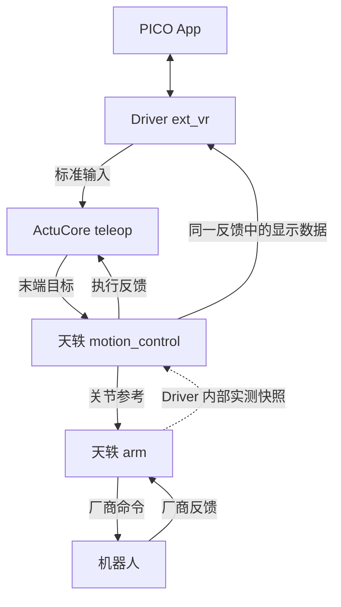

> 历史四卡方案，已被 [双 Driver 当前实施契约](tianyi-teleop-control.md) 替代。以下内容仅供历史对照，不作为本轮实现或验收要求。

# 天轶双臂 motion_control / arm：四卡实施与验收契约

关联 PR：[ext_vr #329](https://github.com/4paradigm/phanthymotus-driver/pull/329) · [teleop #259](https://github.com/4paradigm/phanthymotus/pull/259) · [天轶执行 #321](https://github.com/4paradigm/phanthymotus-driver/pull/321) · [G1 执行 #330](https://github.com/4paradigm/phanthymotus-driver/pull/330)。

让天轶 Driver 接收通用末端目标，由 `motion_control` 解算为关节参考，再由现有 `arm` 连续执行。本文件同时作为 [Driver #321](https://github.com/4paradigm/phanthymotus-driver/pull/321) 的实施依据与现场验收清单。配套主仓 [#259](https://github.com/4paradigm/phanthymotus/pull/259)；ext_vr 和北京 G1 执行各用独立新 PR。

**状态：Draft，2026-09-23 修订。基于 [#321](https://github.com/4paradigm/phanthymotus-driver/pull/321) 远端 `86de1680703d68eab2c6c610801f70c73a406bc2` 整理契约，本次仅改文档，没有采用旧工作树的代码候选。现有三卡实现及其历史验证，与下述待完成的四卡要求分开记录；未完成新架构验收。** 历史 PR 正文及原始构建、测试和部署回执保留在[历史归档](../validation/teleop-pr321-history-20260923.md)，不得作为本轮通过记录。

## 确定的架构

| 组件 | 职责和边界 |
|---|---|
| ext_vr，独立 PR | PICO App、下载邀请、配对、采集、标准输入、显示传输及设备监控；不解算模型或持有运动租约 |
| teleop，[#259](https://github.com/4paradigm/phanthymotus/pull/259) | 通用输入绑定、使能策略、相对映射、开始/结束编排；不加载天轶 URDF，不运行 IK，不中转显示帧 |
| motion_control，本 PR | 天轶 URDF/TCP/标定、FK/IK、碰撞验证、关节参考、实测末端与显示数据、既有收臂编排 |
| arm，本 PR | 连续目标入口、执行权、实际反馈、插补限速、最终运动放行、保持停止及厂商下发 |

天轶与北京 G1 的实现不同，但卡片端口和报文语义相同。namespace、模型、关节名、数量、限位和厂商协议由对应 Driver 声明，不能靠 `robot_profile` 猜测维数。

| 方向 | 端口 / topic | 固定格式与语义 |
|---|---|---|
| teleop → motion_control | `targets` / `/<namespace>/motion/control/command` | `control/eef`，`motus.control/2` 的 `eef_pose`；双末端各 xyz+xyzw，单位 m、单位四元数，共14个数 |
| motion_control → arm | `joints` → `targets` / `/<namespace>/motion/arm/command` | `control/joint`，`motus.control/2` 的 `joint_position`；按 `joint_names` 排列，单位 rad，天轶14关节、北京 G1_23 为10关节 |
| motion_control → teleop、ext_vr | `feedback` / `/<namespace>/motion/teleop/feedback` | `data/json`，统一 `motus.motion.feedback/1`；两消费者订阅同一份反馈，分别用于会话控制和头显显示 |
| arm → motion_control | Driver 内部快照，不新增 topic | 关节名与 q/dq、实测时间、新鲜度、执行序号、所有权、保持/停止确认和错误 |

`info` 返回的绑定和描述符是实际 topic 与能力的依据；上述路径为两机型共同约定。EEF 的14个数不是14关节。joint 描述符的 groups、limits 和维数随机型变化；旧动作及 `/1` 协议保留原有单位和语义。

同一反馈包含会话/代次/源序号、执行状态及原因、实测 q/dq、实测末端、IK 决策、收臂进度和显示结构。显示结构按末端标识组织可变长度线链，区分实测、当前 IK、历史保持模型、目标与躯干参考线，并携带时效；不另增 visualization schema，不把旧模型标成当前有效数据。反馈由一个发布者输出，`motion_control → teleop` 与 `motion_control → ext_vr` 是独立消费关系，没有 `teleop → ext_vr` 显示中转。反馈边不参与正向启动依赖排序，显示完成也不是动作执行回执。

连续数据保持同机 ROS 2 domain 42、loopback 隔离、最新目标模式；低频管理使用绑定的 MCP 入口，开始、结束和停止的可靠请求及完成回执不能放进会被覆盖的最新帧队列。命令携带 session、seq、source_seq、mapping_epoch、模型/标定版本及原始截止时间。v2 输入和关节参考的有效期最多300ms，下游不能晚于源输入；头显采集时钟不能直接当机器人单调时钟。此为待统一契约，不将历史三卡代码中的100ms关节窗口写成已调整。

## 使用与范围

本 PR 只实现天轶双臂，不新增手、腿或底盘动作。Canvas 使用 `ext_vr → teleop → motion_control → arm`；ext_vr 配置下载、配对和设备，teleop 配置输入与映射，motion_control 配置已挂载的模型/标定及速度，arm 展示执行状态及既有操作。正常使用无需后端试验脚本，也不增加第二个 ActuCore。模型来源和许可继续保留在 [NOTICE](../../x-humanoid/tianyi2.0/tianyi_motion/NOTICE.md)。

开启 Canvas 智能控制只准备链路；PICO 开始遥操后进入待使能，同时按住两侧握把才执行。松开任一握把保持，重新握住时以新鲜实测重新建立相对基准。恢复 PICO 连接不等于重新开始运动。

持续握把时，输入丢帧、短暂 IK 失败或通信停顿不得误作松握重握：恢复后保留原映射，使用新鲜输入从当前保持位置限速追赶最新目标，不吞掉停顿期间的位移，也不播放积压历史。两帧有效目标有大跳变时应平滑追赶；操作者手停住但仍有新采样时应继续完成该动作。无新鲜输入时不能靠旧参考无限续行。

暂时不可达、碰撞或超出活动范围时，停在最后有效位置附近，继续处理新输入；回到有效范围后可继续，不新增越界搜索。真正硬件 fault、显式停止及释放不能被自动恢复越过。显示应说明当前在跟随、保持还是故障，并给出原因，不能只显示“运行中”。

执行与恢复改造按以下边界实现：

- 数值工作保持独立进程。IK 输出完整关节参考，取消“每收到一个输入帧只推进20ms”的重复限幅；arm 唯一负责连续插补限速，按有上限的实际周期时间推进，不积攒断流时长。默认1rad/s，约20Hz输入可用；不要求稳定50Hz，不增加百分比误差或累计行程门槛。
- 完整目标端点通过不代表运动段安全。数值进程提供关联目标和代次的已验证运动包络，arm 轻量核验实测、上一命令与下一步是否在包络内；越出则保持并异步更新验证。执行 watchdog 不同步等待 URDF/FK/碰撞求解，不缩小碰撞边界。
- 最新帧策略同时覆盖 DDS、IPC 和内部队列。过期或旧代次结果丢弃，不延长寿命；IK 工作进程恢复不重试旧请求。反馈时间来自实际样本，重算显示不刷新实测时间。
- 状态线程拥堵仅保留最新反馈，并可在拥堵解除后继续；DDS bus 退出或通信失效进入保持，局部恢复保留真实租约、释放请求和 finish 回执，清空旧队列并隔离旧代次。不能靠重启 Driver 清租约或把一次反馈发送失败变成永久卡死。停止入口与反馈处理不能被数值任务阻塞。
- “结束并收臂”复用 `finish/finish_status`，目标仍受本机标定的零位、限位和碰撞验证；必须有实测到位、停止及释放回执。“立即停止”复用 `stop/release`，保持且不额外收臂。重复点击、响应丢失及失败重试保持幂等；已受理的收臂不依赖 PICO 在线。硬件故障时明确报告阻断，不伪报归零、停止或释放成功。

保留现有 `move_pos/move_ctrl/move_traj`、旧遥操及其他卡片的功能。共享执行权覆盖同一批执行器；不把停止发布、MCP受理或重启后的空闲当成本体完成动作。G1 复用其既有 `arm.release`，本 PR 不复制该厂商动作，也不新增通用 `return_to_zero` API。

## 本 PR 交付与验证状态

冻结行为基线保留 ActuCore unified r4 `sha256:584e7d3402c52c93a976f39740057dd73b9b90a06d0d4f935f356e035104c091` 与 Driver operator r16 `sha256:f41c7bb5352a29d3a41dc3d5d6357000a2634ad27cfb580d4546a9b1476288c1`。迁移前后使用相同录制、模型、标定、初始实测和运行资源比较；历史标定与当前标定不一致时，找回原文件或让冻结版和候选在同一新配置上重跑，不能复用旧结果。移除输入频率导致的慢速是预期差异，不要求逐帧关节值相同。

`86de168` 已有三卡、描述符校验、连续执行及历史测试；旧工作树另有数值隔离和恢复候选，但本文件不代表已采用或部署。四卡反馈直达 ext_vr、统一反馈契约、输入跳变与20Hz连续插补、通信局部恢复均按下表重新交付。历史14号关节错误码5的真实恢复没有新证据，仅限制天轶相关动作测试，不阻塞离线工作或北京G1。

| 编号 | 前置条件 | 操作 | 预期与需保留证据 |
|---|---|---|---|
| TY-01 接口与零输出 | 离线、标定与描述符已固定 | 校验 EEF14、joint14、单位/关节序/版本；启动四卡及 Preview | 错误声明在执行前拒绝；Preview 无执行权与厂商目标；正确绑定可读回 |
| TY-02 先验证执行 | 独立有限速度 plant，或空闲且已完成现场预检 | 不运行实时IK，回放已验证关节目标 | 实测逐步追踪，接收、下发、实际响应分开记录；收到topic不当完成 |
| TY-03 完整求解链 | TY-02通过；同一录制、模型、标定与起点 | 回放 EEF＋真实IK，并与 r4/r16 对照 | 每次中断可归因，报告各段延迟、最长空窗与实际误差；不另设误差门槛 |
| TY-04 低频与手停住 | 新鲜输入持续，速度1rad/s | 以20Hz移动后持续发送相同末端位置 | arm 持续限速追踪至目标，不因输入少于50Hz或目标相同而提前停住 |
| TY-05 跳帧与恢复 | 原映射有效、握把持续使能；离线故障注入先通过 | 制造短/长输入缺口，恢复为有位移跳变的新鲜目标 | 缺口保持；恢复保持原映射并平滑追赶，旧帧不重放、断流时间不累积成大步 |
| TY-06 越界与回界 | 已验证模型与碰撞空间 | 输入不可达/碰撞目标，再回到有效范围 | 保持最后有效位置附近；持续新输入下回界后继续；原因与显示一致 |
| TY-07 进程与队列故障 | 禁网、无硬件 plant；真机只复测获准场景 | 分别阻塞/退出IK、拥堵状态队列、暂停/退出bus | 执行与停止不被拖死；故障可见；局部恢复后只执行新数据，不重启Driver清租约 |
| TY-08 实际运动段 | 离线模型与包络记录可检查 | 给完整目标，改变实测滞后及步进间隔 | 每个实际下发步都在验证包络内；超出先保持再异步校验，数值耗时不阻塞停止 |
| TY-09 松握重握 | 四卡就绪、实际PICO输入 | 松开任一握把，再同时握住并移动 | 松握保持；重握使用当时实测建立新基准；可重复操作且无目标跳变 |
| TY-10 收臂与回执 | 可收臂姿态及有效反馈 | 结束并收臂；重复点击/模拟丢回执；查询完成 | 同一操作不重复运动，真实到位且释放才成功；失败原因可见、可重试 |
| TY-11 立即停止与离线终端 | 受理运动或收臂；故障注入先离线完成 | 立即停止，另测PICO断开/IK不可用时Driver停止 | 停止取消后续目标、不额外回零；反馈与实际保持/释放吻合；不因终端离线失去停止入口 |
| TY-12 反馈直达与可观测 | teleop/ext_vr都绑定同一motion反馈 | 检查两消费者；输入/显示短暂停顿 | 实测、IK、保持历史和时效能区分；显示不经teleop中转，不阻塞命令 |
| TY-13 旧功能及故障显示 | 对应模式独立运行；硬件错误仅离线注入 | 回归旧动作/v1、并发资源拒绝、硬件fault与停止失败 | 旧行为兼容；不静默抢占；故障不自动越过，不伪报已停止或已释放 |
| TY-14 ROS与最终现场流程 | 机器人空闲；候选及配套版本固定 | 核对节点/topic/QoS，再走开始→跟随→松握重握→收臂→停止项目 | 厂商命令与实测记录完整，终端状态一致，无未解释卡死；检查实际退出和控制权结果 |

以上条目按以下四阶段推进，不能交换顺序；每条回执记入对应提交、镜像、配套版本、配置和证据位置。

| 阶段 | 进入条件 | 完成证据 | 本轮状态 |
|---|---|---|---|
| 1 离线测试 | 契约、基线与候选来源固定 | 对应 TY 条目、实际目标架构构建和隔离DDS；有限速度反馈不由目标直接覆写 | 待本轮执行 |
| 2 开发真机测试 | 阶段1通过，设备空闲且当前反馈/运行条件满足 | 独立厂商命令与关节反馈、PICO真实操作、收臂停止及恢复记录 | 待本轮执行 |
| 3 精确HEAD BOT review | 阶段2通过，候选提交固定 | 该HEAD审查及构建通过；审查改动重跑受影响离线/开发真机测试并复审 | 尚不申请本轮复审 |
| 4 最终真机验收 | 使用阶段3通过的最终版本组合 | 现场验收者按TY清单复验完整流程，确认真实反馈与界面结果 | 待验收；通过后才算完成 |

天轶与北京G1同时准备、独立验收，哪个空闲先测试哪个；占用设备不切换或试动作。G1通过不替代天轶结果，天轶硬件问题也不阻塞G1。统计允许跳过已被更新的历史目标，但必须说明最新有效目标是否及时到达、每次停顿原因及恢复时间，不能用输入帧数等于执行帧数作为标准。

### 每项验收记录模板

| 条目 ID | 阶段/设备 | Driver/Core/ActuCore/ext_vr 源码 SHA，镜像/APK/模型/配置身份 | 实际步骤及证据链接 | 实际结果与失败原因 | 验收人/日期 |
|---|---|---|---|---|---|
| TY-xx | 待填写 | 待填写；镜像用不可变 ID/digest，配置与模型用 hash | 待填写；标明离线替身、合成输入或真实硬件 | 未验收 | 待填写；不代签 |

每阶段单独填写，保留失败及复测记录；未填字段不作为通过。验收身份及证据记录必须能关联到用户或雨强实际检查的最终版本组合。
