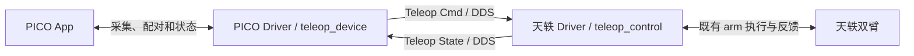

让 PICO 标准输入直接进入天轶 Driver，由一张 Teleop Control 卡片完成双臂映射、IK、持续执行与结束收臂。关联 [PICO设备Driver #329](https://github.com/4paradigm/phanthymotus-driver/pull/329)。用户不再连接独立的ActuCore teleop、motion_control和arm卡片。

## 确定的架构

本轮只交付 #329 与 #321，两张卡全部位于 Driver 层。Agent Core、ActuCore 零代码变更，也不依赖旧遥操专用代理、鉴权 Header、绑定管理、模板或反馈边。宿主能力不足须列出证据、影响及选项，交由韩泽北决策，不静默增加 Core 改动或脚本替代流程。#259 与 G1 #330 不属于本轮交付。

Canvas 只需连接 teleop_device → teleop_control；两 Driver 根据同一实例派生反向反馈绑定，无需用户画循环边。MCP 只负责注册、查询、配置和生命周期，连续输入、操作请求与回执通过 DDS。两卡可分别启动，未连接时返回明确待就绪状态，不无限阻塞项目启动。

普通Core齿轮页不支持可点击网址。本轮采用安装步骤与网址字段展示、用户复制到浏览器的入口；用户已于2026-09-23明确接受，Core继续零改动。实体PICO的浏览器下载/安装/证书信任仍单独验收。

### 输入、反馈与生命周期

| 方向 | topic / format / schema | 内容 |
|---|---|---|
| PICO → 天轶 | `/<namespace>/teleop/<instance>/command`；`data/teleop-cmd`；`motus.teleop.command/1` | 标准双手柄、头显参考、握把、跟踪有效性；独立操作请求 |
| 天轶 → PICO | 对应 `/feedback`；`data/teleop-state`；`motus.teleop.feedback/1` | 能力、会话、源序号、IK/执行原因、实测状态及操作最终回执 |

两端使用同机隔离 DDS domain 42、版本化 JSON。设备输入保留 instance/device、connection_epoch、space_epoch、sequence、采集与接收单调时间、clock_id；位置为米、四元数 xyzw，设备跟踪系 X前/Y左/Z上，不能当机器人基座系。旧采集协议可在设备内部复用，外部不能把旧schema冒充新schema。未知schema、非法数值、过期或旧代次输入明确拒绝。

姿态 latest-only；操作请求与可覆盖姿态缓存分开，携带 request_id，受限重试、去重并返回最终完成/失败结果。停止优先，不等待长收臂、IK或显示操作。旧连接的开始请求不重放；心跳和转发不刷新旧位姿有效期。反馈慢不能拖住输入或停止。敏感配对资料不进入topic和可分享配置。

Canvas启动仅使接口就绪，无自动动作；PICO开始建立操作会话。松握保持；再次双握只处理下一有效输入帧，沿用原映射，不重标定。PICO结束并收臂使用受控自然下垂动作，以实测确认完成。PICO立即停止及Canvas停止只中止当前操作并保持，不追加收臂。

## 冻结基线与明确差异

行为对照组合为 Tianyi ActuCore unified r4 `sha256:584e7d3402c52c93a976f39740057dd73b9b90a06d0d4f935f356e035104c091` 与 Driver operator r16 `sha256:f41c7bb5352a29d3a41dc3d5d6357000a2634ad27cfb580d4546a9b1476288c1`。补齐源码、APK、模型、标定和录制身份，固定同一输入、初态及速度再比较。旧测试不是本轮通过证据。

应保留坐标方向、可完成动作链和收臂表现。用户已批准的行为变化：重握不重标定、输入和执行频率解耦、Canvas停止仅保持。新增平滑独立开关与对照，不与架构迁移混在一起归因。首轮速度1rad/s；约20Hz输入是测试场景，不要求稳定50Hz，不新增百分比误差门槛。如实记录误差、延迟、最长中断和恢复时间；可以短暂停顿，条件恢复后必须继续。

## 本 PR 实现与使用

- 首版仅天轶双臂；机器人能力由Driver声明，手、腿、底盘待后续实现。不建设跨厂商的统一总控制器；保留自身执行写入、反馈、限位与真实故障保护。
- 复用现有arm的厂商发布、实测反馈和自然下垂流程。执行主进程处理MCP/DDS、状态、插补、保持和停止；IK工作进程处理URDF/FK/IK和碰撞。有界队列只保留最新目标。保留现有厂商DDS与本机DDS的隔离辅助进程，不为了凑进程数量破坏隔离；它不是额外卡片或服务。
- 模型准备完成后重新取新鲜输入及机器人实测FK，开始会话时建立一次映射。松握只保持，重握直接对下一有效帧求目标，anchor与mapping_epoch不变；执行租约更新、短暂IK/通信恢复均不重标定。实测关节用作IK初值、执行起点和运动段检查，不能替换映射原点。
- 真正空间重置进入needs_calibration；握把不能解除。不可达或碰撞保持最后有效位置附近，持续求解新输入，回界后继续，不新增越界搜索。
- 新鲜但不变的输入继续追向目标；丢帧后平滑追最新目标，不补播旧帧或累计停顿时间突然跳跃。执行以真实周期推进；输入去噪、执行速度/加速度平滑独立对照，不过滤停止和跟踪失效信号。
- PICO结束复用自然下垂目标与收臂流程，不把任意全零关节数组当安全姿态。立即停止可取消收臂；Canvas停止只保持；无头显时仍能停止自身输出。受理不等于动作完成，真实硬件错误不能伪报完成或释放。
- 默认Shadow且启动零输出，Live显式配置。位置比例默认0.5，对照速度1rad/s；在齿轮配置并持久化回读，关键参数运行中变更明确拒绝。

### 验收清单

| ID | 待验收行为 | 当前状态 |
|---|---|---|
| TY-01 | 普通Core两卡配置、不同启动顺序、实际双向DDS、专用schema及启动零输出，无Core/ActuCore定制依赖 | 普通Core模块隔离验证及真实DDS通过；生产整页待验收 |
| TY-02 | 固定关节回放和原始PICO输入回放分别与冻结版同条件对照，记录输入/IK/接受拒绝/厂商下发/实测 | 719帧冻结数值对照通过；完整执行链/真机对照待验收 |
| TY-03 | 冷加载后新鲜基准；手柄与实测不匹配重握、十轮暂停恢复、执行租约重建，映射不变且完整位移保留 | 软件回归及真实DDS十轮重握通过，映射代次保持1；现场待验收 |
| TY-04 | 20Hz、静止新鲜输入、丢帧跳变、越界回界正常恢复；无历史补播、永久卡死；空间重置要求标定 | 20Hz、断流恢复、证明边沿继续的软件/DDS验证通过；现场待验收 |
| TY-05 | IK卡住/退出、反馈拥堵、通信异常、重复请求和丢回执不拖死停止；真实故障不伪报恢复 | 进程/队列/停止竞态回归通过；真实故障验收待完成 |
| TY-06 | 实体PICO开始/跟随/松握重握/结束收臂；立即停止和Canvas停止只保持；旧arm与普通功能回归 | 有限速plant开始/收臂/停止通过；实体PICO与真机待验收 |

## 交付与验证状态

状态：双Driver主体实现及以下离线验证已完成，2026-09-23。本轮477项相关回归通过；6项未修改的servo历史失败已在原HEAD独立复现，未计入通过数。普通ARM64镜像及真实DDS十轮恢复通过。详见[本轮集成记录](../validation/tianyi-two-driver-integration-20260923.md)。开发真机、BOT及最终验收尚未完成。

现场补充：已完成一次空闲部署与注册，随后遇到新编辑锁及整套服务并发重建，两卡画布尚未写入、真机尚未验收。当前状态见[现场部署记录](../validation/two-driver-site-20260923.md)；保留最新Core/ActuCore，确认更新结束后再恢复Driver。

顺序：离线及普通Core隔离集成 → 开发真机 → 针对通过测试的精确提交申请BOT review → 最终真机验收。未完成的阶段不得提前标为通过，不自动合并。每项记录源码SHA、模型/配置、操作命令、结果、证据位置和未验证项。部署不替代物理动作证据。

由韩泽北负责本轮交付，两个子Agent分别实现两PR，主Agent负责契约、集成与冻结对照；不等待其他开发者先交付可用版。代码、README与本验收契约同次范围化提交，范围变化先同步契约。旧PR评论和历史证据保留但不混入本轮验收。
