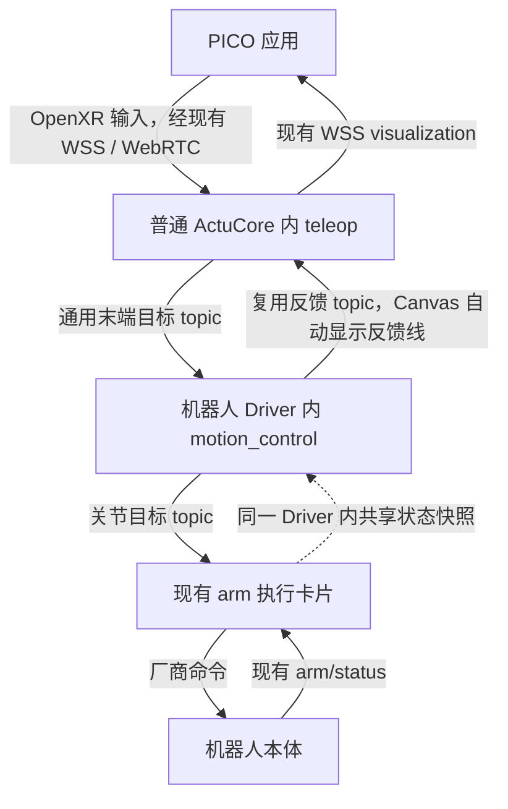

# PR #321 历史正文归档（2026-09-23）

> 本文是修订前 PR 正文的原文归档，保留历史测试、构建、部署及审查证据。正文中的“最新”“当前”“已部署”只适用于原记录，不表示今天的设备状态，也不构成新四卡方案验收。后续实施以[天轶双臂契约](../plans/tianyi-dual-arm-motion-contract.md)为准。

原 PR：[#321](https://github.com/4paradigm/phanthymotus-driver/pull/321)。归档时 HEAD：`86de1680703d68eab2c6c610801f70c73a406bc2`。

---

让现有天轶 Driver 接收通用末端目标、完成运动学解算，再通过已有 arm 卡片执行，消除 ActuCore 对天轶控制模型的依赖。配套 ActuCore/Canvas/PICO：[#259](https://github.com/4paradigm/phanthymotus/pull/259)。

**状态：Draft。`388fe78` 已在天轶 Orin 原生构建并部署禁执行配置，真实 ROS Shadow 链路通过；`37fd287` 的 bus 修复已由 bot 构建；最新 `86de168` 追加 v2 启动描述符校验，离线及 ARM64 候选验证通过，已重新申请 bot，尚未部署。新版物理跟随/收臂尚未验收。**

## 确定的架构

| 边界 | 职责 |
|---|---|
| ActuCore `teleop` | PICO 接入、配对、跟踪与握把、通用相对映射、末端目标、显示反馈转发；新天轶路径不加载 URDF 或运行 IK |
| Driver `motion_control` | 机器人 URDF/TCP/标定、FK/IK、碰撞、执行器映射、运动会话及结束收臂；在现有 Driver 内，不新增服务 |
| Driver `arm` 等执行卡片 | 新增非阻塞连续目标 topic 入口，复用现有硬件发布与反馈；共享执行权、最终关节限位限速、断流保持与停止确认 |

`arm → motion_control` 直接共享 Driver 内实测缓存和执行记录，不新增反馈 topic 或 Canvas 边。`motion_control → teleop` 复用已有反馈 topic，增加实际姿态、IK 与状态；Canvas 随正向控制连接自动建立并显示这条反馈线，且反馈边不参与启动依赖排序。`teleop → PICO` 保留现有 WSS 显示通道。反馈异步处理，不要求每条运动指令等显示完成。

连续数据沿用同机 ROS 2 domain 42、最新目标模式。新增 `motus.control/2`，复用 `/1` 的 mode/values/groups 语义并明确会话、序号、输入关联、映射代次、单调时钟期限与鉴权；旧 `/1` 保持兼容。上游 `eef_pose` 是指定坐标系下的米制 xyz + xyzw 单位四元数，下游 `joint_position` 是声明顺序的 rad 关节目标。低频管理继续使用 MCP。

每次重新使能使用 Driver 新鲜实测末端快照建立相对基准；旧映射或过期 IK 结果丢弃。碰撞、不可达或短暂 IK 失败保持最后有效位置附近，持续求解最新输入并同会话恢复，不增加越界搜索。结束收臂由 Driver 返回厂商模型双臂零位（14 关节 q=0，本轮自然下垂目标），按真实反馈确认后释放；立即停止不收臂。Shadow 无执行权和硬件目标，重新连接或重启不自动恢复运动。

## 使用与范围

Canvas 模板为 `teleop → motion_control → arm`，配置和启停无需后端试验脚本。配置页提供二维码/短地址，从普通 ActuCore 容器下载固定签名 APK；安装后回页面点“打开并连接”，深链接预填机器人配置并消费 15 分钟、单次、可撤销邀请。已配对应用可自动重连，但不能自动开始运动。系统安装确认保留；系统扫码能力另作 PICO 实机验证，短地址为备用。

本轮只迁移天轶双臂。双臂使用同一租约和一个原子命令，descriptor 声明左右各 7 关节的 arm_l/arm_r group，执行默认 1 rad/s。协议按能力描述支持未来单臂、手和其他末端，不在本轮实现手腿控制或跨卡原子执行。现有 G1 路径、VLA、`move_pos/move_ctrl/move_traj` 和 `/1` 保留，不把关节数组重新解释成位姿。

普通 ActuCore 与 VLA 共用服务；不增加遥操容器，不要求 bot 新开关。Agent Core 仅增量改动端口协商、自动反馈线、配置与下载代理，不覆盖其他业务修改。

## 本 PR 交付与验证状态

本仓实现 `/2` 契约、`motion_control`、控制模型与标定、IK/碰撞/收臂迁移、`arm` 连续目标入口和统一执行反馈。`arm → motion_control` 的内部快照由此仓负责，不能用收到 topic 或 publish 返回替代真实执行成功。复用当前 MotionGate 的执行检查，避免再叠一套 watchdog/限速/自动重获租约状态机。

本轮验证：Driver 相关回归 **294 passed**，其中新增 motion_control/bus 专项 31 项。真实 IK、有限速度反馈模拟覆盖两段目标、会话/鉴权/过期/旧基准拒绝、preview 零硬件输出、恢复、收臂取消及失败。既有 servo 扩展回归 6 failed / 19 passed 已在未修改的 `c32c6cc` 基线归档复现；没有将其标为通过，也没有改动 servo 实现。

配套主仓已用当前 Driver 在本机 ARM64 禁网只读容器跑真实 ROS 集成：**2 passed**，真实 bus 子进程、domain 42、EEF/joint/feedback topic 与实际 IK/执行门；MCP HTTP 和厂商本体仍是替身。Shadow 无 joint/厂商输出，Live 有限速度模拟产生反馈并确认保持，不能据此声称真机通过。默认 1 rad/s；100 ms IK 预算不放宽。本机 ARM64 20 轮最小目标求解未复现旧 bot 超时，仍需新镜像中的完整重测。

`motion_control` 卡片支持 `calibration_path` 和 `joint_velocity_rad_s`，空闲时验证后原子应用；模型/TCP/碰撞参数由 Driver 导入。新增代码与接口文档、模型来源/许可、验证记录在同一提交。双臂配置 `hands_enabled=false` 时支持 arm-only bundle，不再无条件要求 hand；缺失/不可信配置与 legacy 仍保留原要求，实际主入口测试覆盖。

bot 前几轮在 ROS 消息 CMake 查库阶段失败，诊断确认库存在。本机原生 ARM64 同上下文完整构建通过；参照 [rcutils 上游调查](https://github.com/ros2/rcutils/issues/525#issuecomment-4049423490) 已用真实 CMake 故障注入复现“遗留 errno 导致空目录误判”。本 HEAD 只对 colcon 构建进程树清除每次 readdir 前的旧 errno，真实 EIO/缺库仍失败；不改变依赖，不放宽运行检查，不修改 bot。

构建相关回归 **36 passed / 1 Linux-only skipped**，Linux ARM64 专项另行 **1 passed**；完整 ARM64 镜像构建及真实 bundle 两轮 Shadow smoke 通过。最终镜像不保留 LD_PRELOAD 或临时库。此前 HEAD `fc06778` 的 bot/QEMU 完整构建已通过（8m 36s），发布镜像为 `release.260922.78af409`（bot 合并构建版本）。[构建回执](https://github.com/4paradigm/phanthymotus-driver/pull/321#issuecomment-5778178148)。代码审查及物理验收分别记录。

新增启停与输入修复：`start` 返回卡片 `ready`，另用 `execution_state` 保留真实执行状态；`motion_control.stop` 取消并等待本卡 IK/收臂线程，未退出则失败且拒绝静默重启，共享反馈与看门狗保持运行。`pause/release` 不关闭卡片；持有执行权或停止未确认时不伪报 idle。无效嵌套报文及 Python 3.10 的 JSON 深度错误被拒绝后继续接收后续帧。

该修复的同一源码快照 `5657373f1c1c` 已在天轶 Orin 原生构建成功，并在实际 Python 3.10 镜像的禁网构建阶段通过 **128 项定向回归**（17.41 s），含 16 项生命周期和 15 项异常输入新增场景；实际 bundle 两轮启停通过，硬件发布者为零。宿主同集合也通过。该原生构建阶段没有改变运行中的服务；后续部署记录见下文。

数值栈体积已按 registry manifest 实测：相对既有 `2255037` 压缩层净增 **116,608,349 B**；锁定数值依赖层为 **116,854,261 B 压缩**。Pinocchio/FK、SciPy/NumPy 及 cmeel ABI 由 Driver 组件锁定，未修改共享基础镜像，不声称零增量。

保持 Draft。用户批准 Core 增量和服务切换后，`388fe78` 已部署为 Shadow、Live 门关闭。真实 domain 42 记录 45 个 EEF 输入、44 个关联决策、190 个反馈，ActuCore 收到 IK 显示数据；joint/cmd_pos/cmd_ctrl 均零消息，Preview 已释放。Canvas 保留原16卡并增量加入三卡与反馈线。只有后续真实双臂跟随与收臂验收记录才能确认新架构的硬件闭环；手、长期运行和崩溃验收不因软件测试通过而自动完成。

最新 bot 意见修复（`37fd287`）：本地 bus 的父执行器→子进程反馈/关节返回方向，逐帧拒绝无效 JSON、非对象、重复键、非有限值及错误路由，坏帧不退出共享子进程或覆盖同批有效帧。旧 legacy DDS 命令原样转交父执行器并触发既有 HOLD，未改为静默忽略。另显式设置 `RCUTILS_COLORIZED_OUTPUT=0`，不新增依赖。

新增30个真实子进程回归，用匿名 socket 和 ROS 替身验证两个方向；不是设备测试。Mac Python3.13 专项65 passed，既有 ARM64镜像内挂载候选源码、禁网只读、Python3.10专项57 passed。隔离旧HEAD验证显示legacy坏命令6项原本通过，父端截断反馈2项确实使旧子进程退出，故没有照搬bot对方向的误述。扩展兼容107 passed / 1 failed；唯一失败为未改动Adam测试互相导入被全仓COPY检查识别，已在隔离388fe78复现相同失败，不掩盖历史问题。当前补丁不沿用旧HEAD构建结果，已重新申请bot。

最新 `37fd287` 的 bot 构建已通过（26 s），镜像 `release.260922.736a0e6`；[构建回执](https://github.com/4paradigm/phanthymotus-driver/pull/321#issuecomment-5779824331)。代码复审和现场部署分别记录。

最新启动协议校验（`86de168`）：两卡在创建工作线程或发布器前检查完整 v2 描述符，包括版本、整数维数、单位、分组、模型/标定/坐标系、速率及关节限位；保留扩展字段和无描述符旧启动。EEF 不套用 v1 的关节/force_torque 必填要求。Mac 240 项、ARM64 Python 3.10 新专项 111 项通过；独立复核的真实 Core 转发契约通过。候选未部署，[本 HEAD bot 请求](https://github.com/4paradigm/phanthymotus-driver/pull/321#issuecomment-5780294677)。
